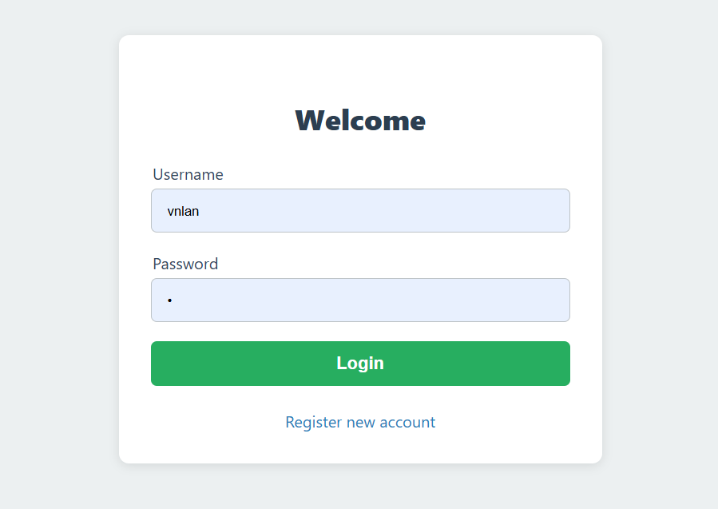
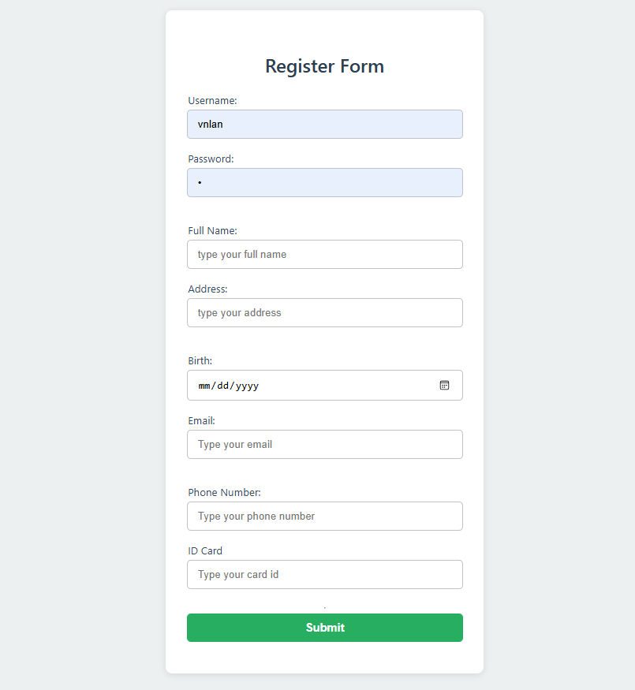
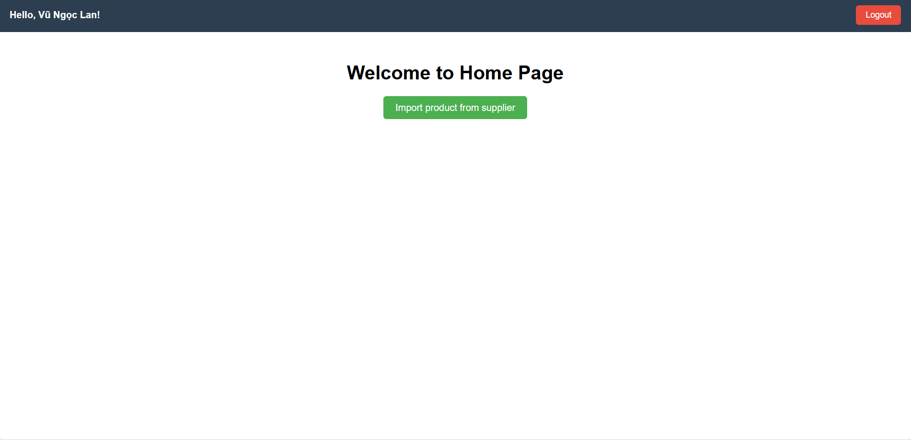
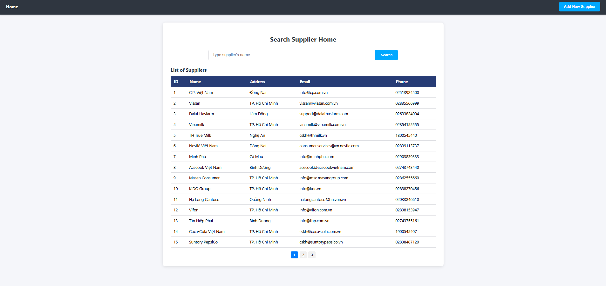
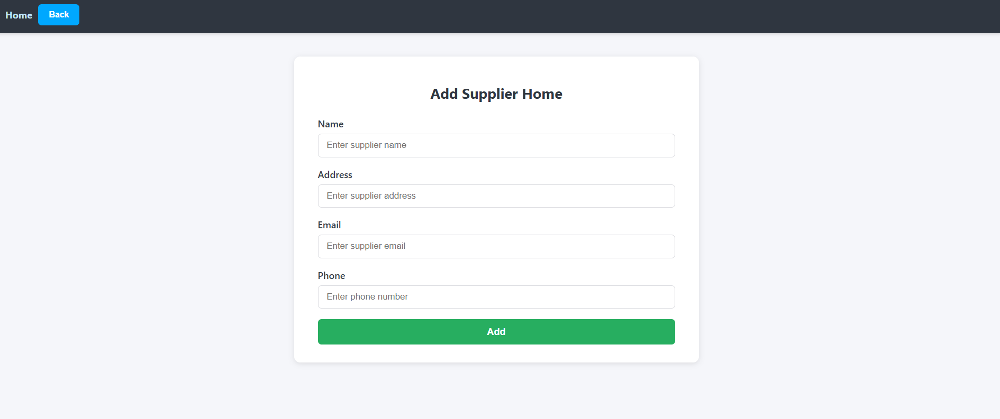
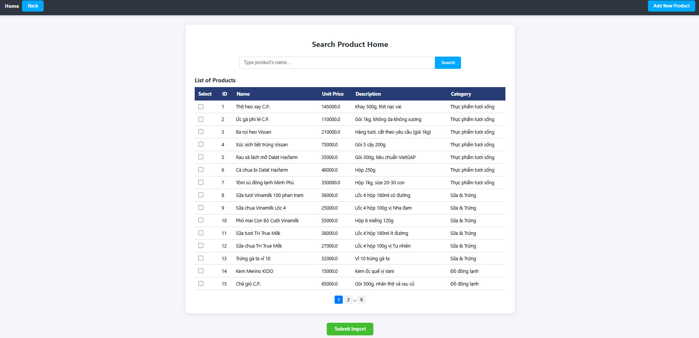
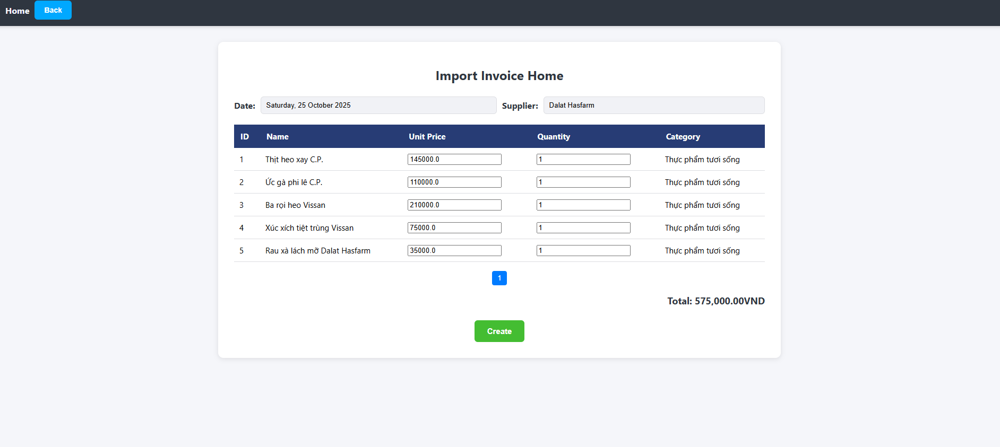
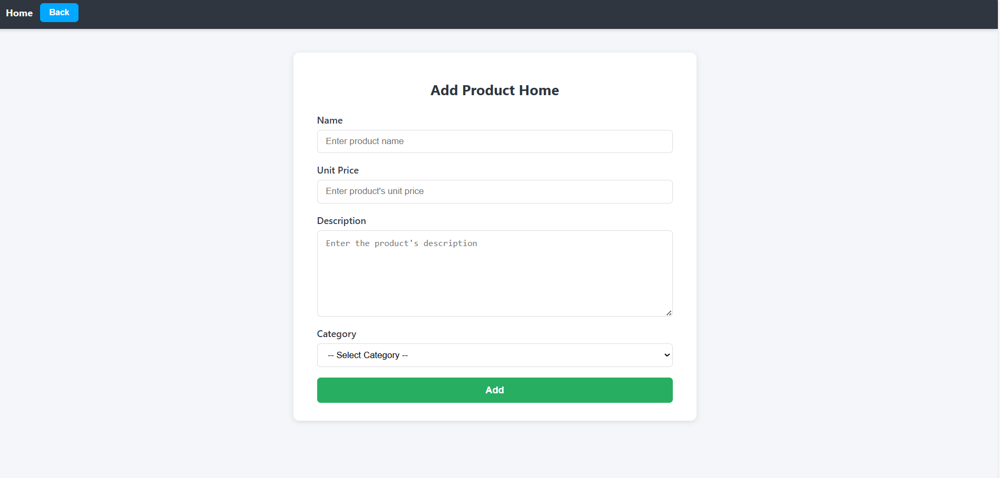
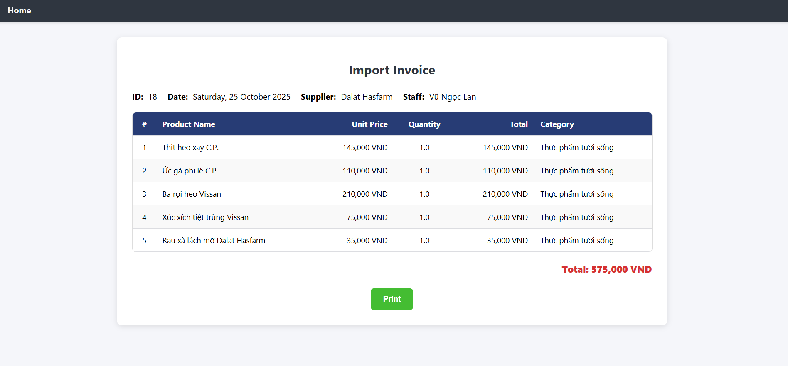

This is the final project for the System Analysis and Design course at PTIT, topic 7. 
# 📌 User Interface (UI) Screenshots

Below are all UI screens designed for the final project of the **System Analysis and Design** course at **PTIT**, Topic 7.  
All images are stored inside the `UI/` directory.

---

## 🔐 1. Login View
The login screen used by the storekeeper to access the system.

---

## 📝 2. Register View
Screen for creating a new user account.

---

## 🏪 3. Main Storekeeper View
The main dashboard for the storekeeper, containing all core management functions.

---

## 🔍 4. Search Supplier View
Interface for searching suppliers based on input criteria.

---

## ➕ 5. Add Supplier View
Screen used to add a new supplier to the system.

---

## 🛒 6. Search Product View
Interface for searching products stored in the warehouse.

---

## 📦 7. Import Invoice View
Screen used to create an import invoice.

---

## ➕ 8. Add Product View
Screen for adding a new product to the warehouse database.

---

## 🖨️ 9. Print Import Invoice View
Preview and print interface for the import invoice.

---

 
